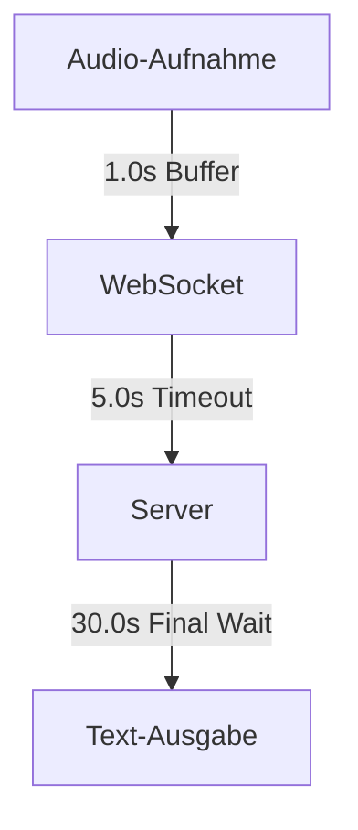

# WhisperClient

Ein Python-basierter Client für Echtzeit-Spracherkennung mit WhisperLive.

## 🎯 Features

- Echtzeit-Audioaufnahme und -Streaming
- WebSocket-basierte Kommunikation mit WhisperLive
- Automatische Textausgabe in aktive Anwendungen
- Konfigurierbare Hotkey-Steuerung (F13/F14)
- Robuste Fehlerbehandlung und Reconnect-Logik

## 🚀 Schnellstart

```bash
# Repository klonen
git clone https://github.com/yourusername/whisper_client.git
cd whisper_client

# Virtuelle Umgebung erstellen
python -m venv venv
source venv/bin/activate  # Linux/Mac
.\venv\Scripts\activate   # Windows

# Abhängigkeiten installieren
pip install -r requirements.txt

# Client starten
python main.py
```

## 📋 Voraussetzungen

- Python 3.12+
- WhisperLive Server
- Windows (für Tastatur-Simulation)
- Mikrofon

## 🔧 Konfiguration

Die Konfiguration erfolgt über `config.py`:
- Audio-Einstellungen (Format, Rate, Buffer)
- WebSocket-Parameter (Host, Port, Timeouts)
- Hotkey-Definitionen
- Logging-Optionen

## 🎛️ Timing-System

Das Projekt verwendet ein ausgeklügeltes Timing-System für optimale Performance:



Detaillierte Diagramme und Dokumentation:
- [Systemarchitektur](docs/diagrams/architecture/system_modules.md)
- [Sequenzablauf](docs/diagrams/sequence/audio_processing.md)
- [Timing-Übersicht](docs/diagrams/timing/system_timings.md)

## 🧪 Tests

```bash
# Timing-Tests ausführen
python run_tests.py
```

Die Tests analysieren:
- Audio-Streaming-Performance
- WebSocket-Kommunikation
- Text-Verarbeitungszeiten
- Fehlerszenarien

## 📚 Dokumentation

- [Entwickler-Dokumentation](docs/development.md)
- [Roadmap](docs/roadmap.md)
- [Test-Spezifikationen](tests/speech_test_cases.md)

## 🤝 Mitmachen

Wir freuen uns über Beiträge! Aktuelle Fokusgebiete:

1. **Server-Integration**
   - WhisperLive Server-Parameter verstehen
   - Timing-Optimierung
   - Protokoll-Dokumentation

2. **Performance**
   - Audio-Streaming-Optimierung
   - Latenz-Minimierung
   - Ressourcen-Effizienz

3. **Benutzerfreundlichkeit**
   - GUI-Entwicklung
   - Konfigurationsschnittstelle
   - Installations-Wizard

### Entwicklungs-Workflow

1. Issue erstellen/auswählen
2. Branch erstellen: `feature/name` oder `fix/name`
3. Änderungen committen (siehe [Commit-Konventionen](docs/development.md#commit-konventionen))
4. Pull Request erstellen
5. Code Review abwarten

## 📝 Lizenz

[MIT](LICENSE)

## 🙏 Danksagung

- [WhisperLive](https://github.com/whisperlive) für den Server
- [OpenAI Whisper](https://github.com/openai/whisper) für das Sprachmodell
- Alle Mitwirkenden und Tester

## 📞 Support

- GitHub Issues für Bugs und Features
- Discussions für Fragen und Ideen
- [Regression Investigation Log](docs/investigations/regression_20250214.md) für bekannte Probleme
