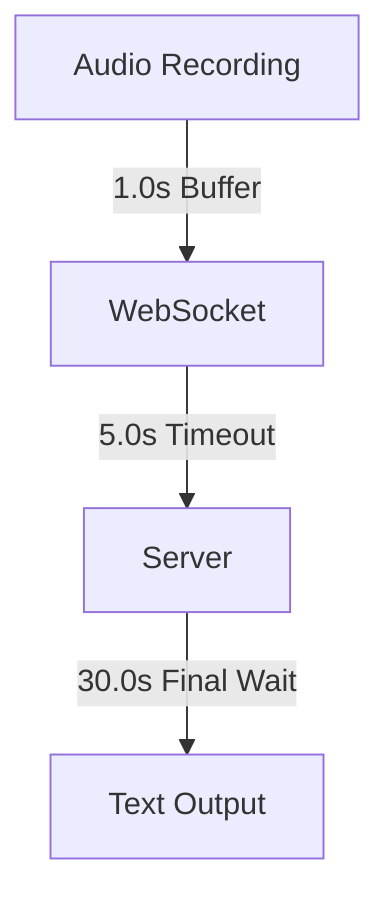

# WhisperClient (Alpha)

A Python-based client for real-time German speech recognition using [WhisperLive](https://github.com/collabora/WhisperLive). This project is currently in **Alpha** stage.

## 🎯 Features

- Real-time audio recording and streaming
- WebSocket-based communication with WhisperLive
- Automatic text output to active applications via Windows SendMessage API
- Configurable hotkey control (F13/F14)
- Robust error handling and reconnect logic
- Optimized for German speech recognition
- Tumbling Window approach for audio processing

## ⚠️ Alpha Status Notice

This project is currently in **Alpha** stage. While the core functionality is implemented and working, you may encounter issues or limitations:

- Some error handling may be incomplete
- Documentation is still being improved
- Performance optimizations are ongoing
- Test coverage is not yet comprehensive

We welcome feedback and contributions to help improve the project!

## 🚀 Quick Start

```bash
# 1. Set up WhisperLive server first
# Follow instructions at: https://github.com/collabora/WhisperLive

# 2. Clone this repository
git clone https://github.com/dnhrdt/whisper_client.git
cd whisper_client

# 3. Create virtual environment
python -m venv venv
source venv/bin/activate  # Linux/Mac
.\venv\Scripts\activate   # Windows

# 4. Install dependencies
pip install -r requirements.txt

# 5. Configure audio device in config.json if needed
# Default is "Poly BT700" - use list_devices.py to find your device

# 6. Start client
python main.py
```

## 📋 Prerequisites

- Python 3.12+
- WhisperLive Server
- Windows (for keyboard simulation)
- Microphone

## 🔧 Configuration

Configuration is managed through `config.json`:
- Audio settings (format, rate, buffer)
- WebSocket parameters (host, port, timeouts)
- Hotkey definitions
- Logging options

## 🎛️ Timing System

The project uses a sophisticated timing system for optimal performance:



Detailed diagrams and documentation:
- [System Architecture](docs/diagrams/architecture/system_modules.md)
- [Sequence Flow](docs/diagrams/sequence/audio_processing.md)
- [Timing Overview](docs/diagrams/timing/system_timings.md)

## 🧪 Tests

```bash
# Run timing tests
python run_tests.py
```

The tests analyze:
- Audio streaming performance
- WebSocket communication
- Text processing times
- Error scenarios

## 📚 Documentation

Our documentation follows the Memory Bank structure for comprehensive project understanding:

- **Product Context** - Core purpose and system architecture
- **System Patterns** - Development standards and architectural patterns
- **Technical Context** - Core technologies and configuration
- **Active Context** - Current development focus and recent changes
- **Progress** - Task tracking and development status

Additional documentation:
- [Roadmap](docs/roadmap.md)
- [Test Specifications](tests/speech_test_cases.md)

## 🤝 Contributing

We welcome contributions! Current focus areas:

1. **Server Integration**
   - Understanding WhisperLive server parameters
   - Timing optimization
   - Protocol documentation

2. **Performance**
   - Audio streaming optimization
   - Latency minimization
   - Resource efficiency

3. **User Experience**
   - GUI development
   - Configuration interface
   - Installation wizard

### Development Workflow

1. Create/select an issue
2. Create branch: `feature/name` or `fix/name`
3. Make changes following project standards
4. Create pull request
5. Await code review

## 📝 License

[MIT](LICENSE)

## 🙏 Acknowledgments

This project builds upon the excellent work of:

- [WhisperLive by Collabora](https://github.com/collabora/WhisperLive) - The server component that powers our speech recognition
- [OpenAI Whisper](https://github.com/openai/whisper) - The underlying speech recognition model
- [faster-whisper](https://github.com/guillaumekln/faster-whisper) - Optimized Whisper implementation
- All contributors and testers who have provided valuable feedback

WhisperClient is an independent project that integrates with WhisperLive but is not officially affiliated with Collabora or OpenAI.

## 📞 Support

- GitHub Issues for bugs and features
- Discussions for questions and ideas
