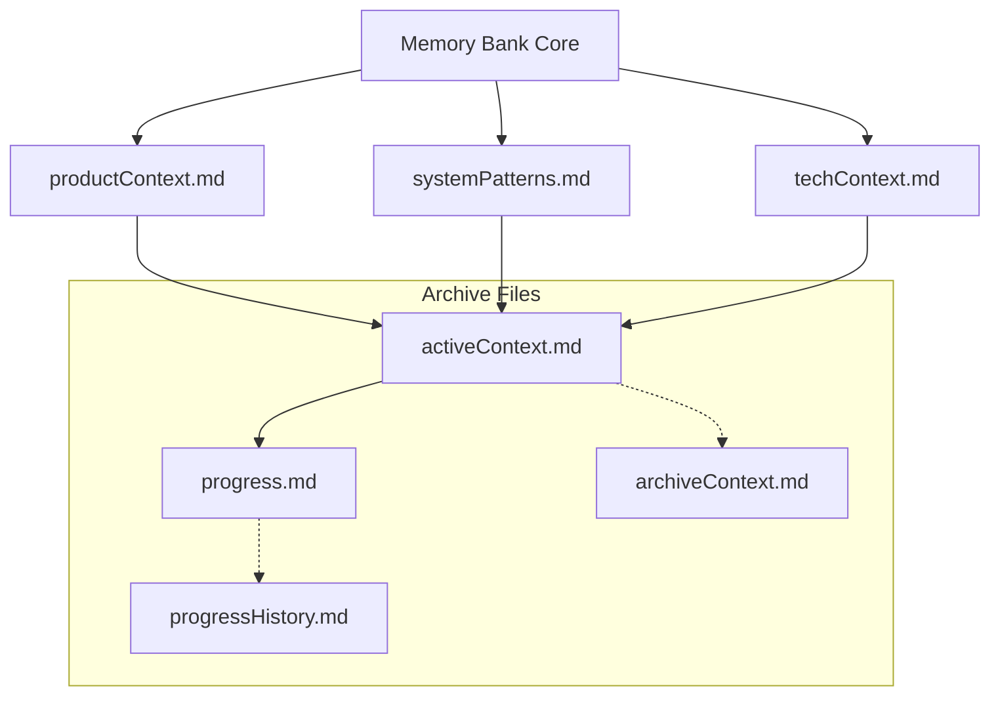

# System Architecture & Patterns
Version: 2.3
Timestamp: 2025-03-09 02:24 CET

## Document Purpose
This document outlines how the system is built, key technical decisions, architectural patterns, and development philosophies used throughout the WhisperClient project.

## Testing Philosophy

### Strategic Testing Decision
> "Prioritize application progress over test perfection"

We've made a strategic decision to prioritize application progress over test perfection, especially for components with different usage patterns in tests versus real-world scenarios. This decision is based on several key factors:

1. **Different Usage Patterns**: Tests rapidly create and destroy connections in sequence, while real usage typically maintains longer-lived connections.
2. **Different Load Profiles**: Tests stress specific components in isolation, while real usage exercises the system holistically.
3. **Different Error Tolerance**: Tests require perfect execution, while real users can tolerate occasional reconnects if they're handled gracefully.

For components like WebSocket connections, we implement minimal safeguards (like timeout mechanisms) and then focus on core functionality improvements that directly impact the user experience.

### Core Testing Axiom
> "The test framework is a tool, not a deliverable"

This axiom guides our testing approach:
1. Focus on core functionality over test infrastructure
2. Implement comprehensive tests only for complex issues
3. Prefer manual verification for straightforward features
4. Keep test framework minimal and maintainable
5. Add complexity only when truly needed

### Test Isolation Patterns
> "Tests should be isolated from each other to ensure reliable results"

1. **Current WebSocket Test Approach**
   - Run tests individually using: `python -m unittest tests/integration/test_websocket_multiple_connections.py::WebSocketMultipleConnectionsTest::test_name`
   - Document behavior of each test when run in isolation
   - Compare with behavior when run as part of the test suite
   - Focus on identifying issues, not implementing fixes yet
   - Document findings in websocket_timing_dependencies.md

2. **Basic Test Isolation Techniques**
   - Use setUp/tearDown to create clean state for each test
   - Ensure proper cleanup of resources after each test
   - Verify cleanup success before proceeding to next test
   - Use unique identifiers for test instances
   - Add debug logging to track test execution flow

3. **Practical Test Execution**
   - Run individual tests first to verify basic functionality
   - Document any issues found during isolated execution
   - Only after all tests pass individually, attempt to run as suite
   - If suite fails, focus on documenting the specific failure points
   - Prioritize analysis over immediate fixes

### Testing Strategy
1. **Essential Testing**
   - Core functionality must be tested
   - Focus on timing and integration
   - Verify critical paths
   - Document test purposes clearly
   - Tests evolve with development needs

2. **Test Runner Implementation**
   - Category-based execution (timing, integration, speech)
   - Minimal configuration (--verbose only)
   - Clear result reporting with emojis
   - Proper error handling
   - See test_runner_usage.md for details

2. **Manual Verification**
   - Preferred for straightforward features
   - Used for basic functionality checks
   - Appropriate for UI/UX testing
   - Efficient for quick validations

3. **Comprehensive Testing**
   - Reserved for complex issues
   - Used when debugging difficult problems
   - Implemented for critical components
   - Added when manual testing is insufficient

4. **Test Framework Guidelines**
   - Keep it simple and maintainable
   - Add features only when needed
   - Focus on utility over complexity
   - Support core development goals
   - Let tests evolve organically
   - Avoid premature test infrastructure
   - Create tests for specific problems
   - Validate approach through usage

## Memory Bank Workflow

### Critical Memory Bank Rules
1. **ALWAYS Check Memory Bank First**
   - Before ANY task or tool use
   - Before exploring other documentation
   - Before making ANY changes
   - No exceptions to this rule

2. **Memory Bank Verification**
   - Read ALL Memory Bank files
   - Verify versions and timestamps
   - Understand complete context
   - Document any missing information

3. **Memory Bank Warning**
   - Memory resets are complete
   - Previous context is ONLY in Memory Bank
   - Skipping Memory Bank leads to errors
   - Example: Task exploration before Memory Bank check can lead to misaligned solutions

4. **Memory Bank Update Completion**
   - After updating all Memory Bank files
   - Before finalizing the session
   - Request user to close all tabs using "Auto Close Tabs: Close as many tabs as possible"
   - Wait for confirmation that tabs are closed
   - This ensures a clean slate for the next session
   - Prevents distraction from open tabs in the next session

5. **Memory Bank First Pattern**
   ```mermaid
   flowchart TD
       A[New Task] --> B[Check Memory Bank]
       B --> C{Complete Context?}
       C -->|No| D[Update Memory Bank]
       D --> B
       C -->|Yes| E[Proceed with Task]
   ```

### Memory Bank Archive Guidelines

#### Archive Purpose
- Archive files store historical information that is no longer immediately relevant
- They reduce context load while preserving complete project history
- They should be accessed only when specifically needed

#### Memory Bank Structure


#### When NOT to Access Archives
- During routine development tasks
- For current sprint/phase planning
- For understanding active features or components
- During normal bug fixing of current functionality

#### When to Access Archives
- When investigating regression bugs with historical roots
- When researching the rationale behind past architectural decisions
- When specifically requested by the user
- When current documentation explicitly references archived information
- When working on components that haven't been modified in multiple phases

#### Archive Access Protocol
1. Always check active Memory Bank files first
2. If information is missing, check development logs
3. Only if critical context is still missing, explicitly state:
   "I need to check the archive files for [specific information]"
4. Get user confirmation before accessing archives
5. After accessing, document the relevant information in current context
6. Return to using only active files

#### Archiving Policy
1. **When to Archive**:
   - After completing a development phase
   - When a task has been completed for more than 2 weeks
   - When strategic focus shifts to a new area
   - Monthly review of active files

2. **How to Archive**:
   - Move completed tasks from `progress.md` to `progressHistory.md`
   - Move outdated context from `activeContext.md` to `archiveContext.md`
   - Update version and timestamp in all modified files
   - Organize archived content chronologically or by phase

3. **Retention Policy**:
   - Keep only the 3-5 most recent completed tasks in `progress.md`
   - Keep only current phase information in `activeContext.md`
   - Maintain comprehensive history in archive files

#### Archive Maintenance
- Review archive files quarterly to ensure they remain well-organized
- Never add new development information directly to archive files
- Archive files should be append-only after initial creation

## How The System Is Built

### Development Standards
1. **Code Style**
   - PEP 8 conventions
   - Typed functions (Python 3.12+)
   - Comprehensive docstrings
   - Clear error handling

2. **Documentation Requirements**
   - ALL changes MUST be documented
   - Commit after each functional change
   - Documentation parallel to code
   - Changes tracked in logs
   - Development history in incremental logs

3. **Line Ending Standards**
   - .gitattributes controls line endings
   - Python files use LF (*.py)
   - Documentation files use LF (*.md, *.txt, *.json)
   - Windows scripts use CRLF (*.bat, *.cmd, *.ps1)
   - Auto-detection for other files

4. **Error Handling Patterns**
   - Connection errors: 5s timeout, 3s reconnect
   - Audio errors: overflow ignoring, stream reset
   - Thread-safe recording control
   - Structured error logging

5. **Code Quality Standards**
   - Linting tools configured with project-specific settings
   - Centralized linting script for consistent execution
   - Pre-commit hooks for automated checks
   - EditorConfig for consistent formatting across editors
   - Standardized line length (100 characters)
   - Consistent import sorting with isort
   - Code formatting with black
   - Type checking with mypy
   - Comprehensive analysis with pylint

### Linting Workflow
1. **Linting Tools Setup**
   - Configuration files in project root:
     * `.editorconfig`: Basic editor settings
     * `.flake8`: Flake8 configuration
     * `.pylintrc`: Pylint configuration
     * `.pre-commit-config.yaml`: Git hooks
     * `pyproject.toml`: Tool-specific configurations

2. **Linting Execution**
   - Use the centralized PowerShell script:
     ```powershell
     # Run all linters
     ./.linting/lint.ps1

     # Run specific linters
     ./.linting/lint.ps1 -isort -black

     # Run on specific files
     ./.linting/lint.ps1 -files "src/audio.py src/websocket.py"

     # Apply automatic fixes
     ./.linting/lint.ps1 -fix
     ```

3. **Linting Integration**
   - Pre-commit hooks for automated checks
   - VSCode integration for real-time feedback
   - CI/CD pipeline integration (future)
   - Regular manual execution during development

4. **Linting Priorities**
   - Critical: Syntax errors, unused imports, bare except clauses
   - Important: Line length, trailing whitespace, consistent formatting
   - Nice-to-have: Docstrings, type annotations, naming conventions

### Development Logging Strategy
Note: This describes the development change tracking system.

### Logging Checklist
1. **When to Update Logs**
   - After implementing a new feature
   - After fixing a bug
   - After significant refactoring
   - After updating documentation
   - After changing configuration
   - Before committing changes to the repository

2. **Which Log Files to Update**
   - For all changes: Create a new incremental log in `logs/increments/`
   - For critical changes: Also add an entry to `logs/main.json`
   - For changes affecting tests: Update test documentation

3. **Log Format Guidelines**
   - Follow the format specified in the "Log Levels & Details" section
   - Use the correct log type (critical, normal, minor) based on the change
   - Include all relevant details (files changed, components affected, etc.)
   - Use ISO-8601 format for timestamps (YYYY-MM-DDThh:mm:ss+01:00)

4. **Memory Bank Integration**
   - Coordinate log updates with Memory Bank updates (not as separate steps)
   - As part of the same workflow, ensure:
     * `activeContext.md` reflects the latest changes
     * `progress.md` is updated with completed tasks and next steps
     * Version and timestamp are updated in all modified Memory Bank files
   - This is not a separate process but part of the existing Memory Bank protocol

5. **Verification Steps**
   - Verify log entries are correctly formatted
   - Ensure all affected files are listed
   - Check that timestamps are accurate
   - Confirm task IDs are consistent across logs and Memory Bank

This checklist ensures consistent and comprehensive logging throughout the development process, maintaining a clear history of changes and facilitating knowledge transfer across memory resets.

## Log Levels & Details

### Critical Changes (Full Detail)
- Regressions and their fixes
- Core feature implementations
- Breaking changes
- Major refactoring

Log Format:
```json
{
  "type": "critical",
  "task_id": "T123",
  "component": "core",
  "description": "Detailed description",
  "details": ["Change 1", "Change 2"],
  "files_changed": ["file1.py", "file2.py"],
  "test_impact": {
    "tests_affected": [],
    "tests_added": []
  },
  "regression_potential": "high"
}
```

### Normal Changes (Basic Detail)
- Minor refactoring
- Significant adjustments
- Test implementations
- Important documentation

Log Format:
```json
{
  "type": "normal",
  "task_id": "T123",
  "component": "tests",
  "description": "Basic description",
  "files_changed": ["test1.py"]
}
```

### Minor Changes (Minimal Detail)
- Small fixes
- Documentation updates
- Cleanup tasks
- Style adjustments

Log Format:
```json
{
  "type": "minor",
  "task_id": "T123",
  "component": "docs",
  "description": "Short description"
}
```

## File Structure
```
logs/
├── main.json         # Critical changes only (max 1MB)
├── increments/       # All changes, auto-generated Task-IDs
│   ├── log_001.json
│   └── log_002.json
└── archive/          # Quarterly consolidated logs
    ├── 2025_Q1.json
    └── 2024_Q4.json
```

### Technical System Logging
- Log Levels and Usage:
  * DEBUG: Development information (WebSocket messages, Audio data details)
  * INFO: Standard events (Connection status, Recording state)
  * WARNING: Non-critical issues (Connection loss, Buffer overflows)
  * ERROR: Critical errors (Device errors, System failures)

- Log Structure:
  ```python
  LOG_FORMAT = {
      'default': "%(asctime)s - %(levelname)s - %(message)s",
      'connection': "%(asctime)s - CONNECTION: %(message)s",
      'audio': "%(asctime)s - AUDIO: %(message)s",
      'text': "%(asctime)s - TEXT: %(message)s",
      'error': "%(asctime)s - ERROR: %(message)s"
  }
```

- Log File Management:
  * Daily rotation
  * Separate console and file handlers
  * Structured error logging
  * Debug information preservation

## Development Workflow

### Change Tracking Format
```json
{
  "timestamp": "ISO-8601",
  "description": "Change description",
  "changes": [
    {
      "type": "refactor|feat|fix|etc",
      "description": "Detailed change info"
    }
  ],
  "status": "in_development|completed|etc",
  "files": ["affected/files.py"]
}
```

### VSCode Snippets
1. **Standard Format** (Trigger: `commit⏎`)
```
feat(audio): overflow-handling implemented

- Buffer size optimized
- Overflow detection added
- Logging improved
```

2. **Complex Changes** (Trigger: `commitc⏎`)
```
refactor(timing): timing parameters centralized

- Parameters moved to config.py
- Documentation extended
- Modules adjusted:
  - WebSocket: Connection timing
  - Audio: Buffer timing
  - Text: Output timing
```

## Version Control Strategy
1. Regular commits on working states
2. Clear change documentation
3. Defined test protocol
4. Focus on relevant issues
5. Better use of version control

### Commit Message Guidelines
1. **Commit Message Best Practices**
   - ALWAYS use `git commit -m "message"` for simple commits
   - For multi-line messages, use `git commit` (without -m) to open editor
   - NEVER create temporary files for commit messages

2. **Alternatives (only in exceptional cases)**
   - Use temporary files ONLY when absolutely unavoidable
   - Delete IMMEDIATELY after use
   - Add naming pattern to .gitignore (e.g., *commit_msg.txt)

## Audio Processing Patterns

### Proof-of-Concept Results
1. **Tumbling Window**
   - 130ms average latency
   - Stable processing (27 windows/3.5s)
   - Overlapping windows for transitions
   - Status: Ready for implementation

2. **Queue-based Chunk Management**
   - Thread and async implementations
   - AudioChunk data model with metadata
   - Enhanced WebSocket integration
   - Status: Conceptually validated

3. **Audio Segmentation**
   - Speech segment detection
   - Energy-based classification
   - Parameter optimization required
   - Status: Partially validated

## Test Framework Architecture

### Speech Test Documentation
- Test cases in `tests/speech_test_cases.md` (maintained in German)
- Progress tracking in `tests/speech_test_progress.json`
- Automatic status updates
- Standardized test cases
- Focus on German speech recognition

### Test Execution Framework
1. **Pre-Test Setup**
   - Clear terminal
   - Fresh program start
   - Single instance check
   - Server logs check

2. **Test Execution**
   - Run single test
   - Analyze server logs
   - Check internal logs
   - Verify sentence processing

3. **Result Documentation**
   - Update speech_test_progress.json
   - Document results
   - Analyze errors
   - Plan next steps

### Server Log Analysis
- WhisperLive Server in WSL
- WSL Path: /home/michael/appdata/whisperlive/logs/
- Windows Access: W:\ (Network share from WSL)
- Portainer timestamps for event analysis
- Post-test log analysis for timing investigation

## Architecture Patterns

### 1. Communication
- WebSocket connection with auto-reconnect
- JSON message format
- Structured error recovery
- Connection state tracking

### 2. Data Processing
- Threaded audio recording
- Float32 normalization
- Buffer management
- Stream synchronization

### 3. Text Handling
- Window detection
- Input simulation
- Clipboard operations
- Sentence boundary detection

### 4. Error Recovery
- Automatic reconnection
- Buffer reset mechanisms
- State restoration
- Thread safety measures

## Collaboration Guidelines

### Environment Awareness
- Check running instances before starting new ones
- Verify system state before changes
- Consider side effects on running processes

### Error Handling Protocol
1. Understand full context before fixing
2. Verify problem understanding with team
3. Consider that "issues" might be intended
4. Document fix attempts and results

### Status Change Rules
- Explicit approval needed for:
  * Test completion marking
  * Next step transitions
  * Task completion
  * Project flow changes

## References
- Development logs: logs/increments/
- Investigation docs: docs/investigations/
- Test documentation: tests/docs/
- Technical setup: tech_context.md
