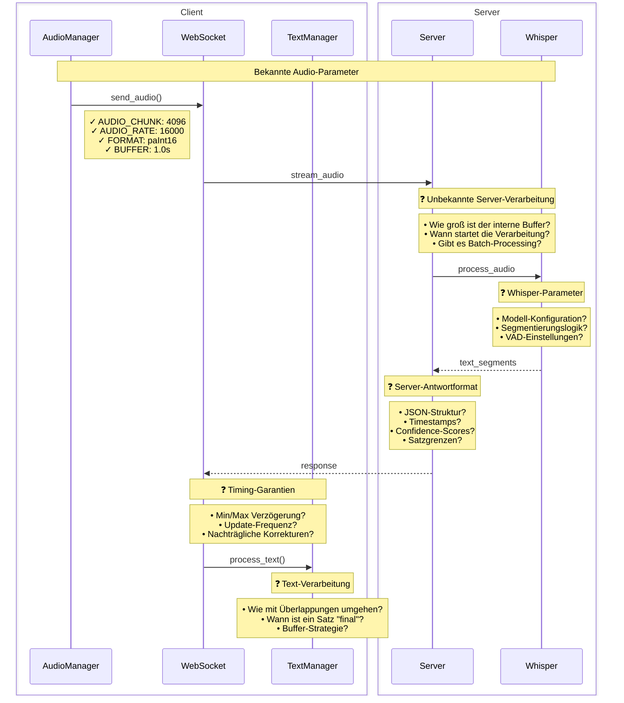

# Audio-Verarbeitung und Server-Kommunikation

## Offene Fragen zur Server-Kommunikation

### Server-Verarbeitung
- Größe des internen Audio-Buffers
- Trigger für Start der Verarbeitung
- Batch-Processing-Strategie

### Whisper-Konfiguration
- Verwendetes Modell und Parameter
- Segmentierungslogik
- VAD (Voice Activity Detection) Einstellungen

### Antwortformat
- Genaue JSON-Struktur
- Vorhandensein von Timestamps
- Confidence-Scores für Erkennungen
- Markierung von Satzgrenzen

### Timing-Garantien
- Minimale/Maximale Verzögerungen
- Frequenz der Updates
- Möglichkeit nachträglicher Korrekturen

### Client-seitige Verarbeitung
- Strategie für überlappende Texte
- Definition von "finalen" Sätzen
- Buffer-Management
