# System-Timing-Übersicht

```mermaid
flowchart TD
    classDef base fill:#e0e0e0,stroke:#000,stroke-width:2px,color:#000
    classDef ws fill:#b3d9ff,stroke:#000,color:#000
    classDef audio fill:#c1f0c1,stroke:#000,color:#000
    classDef error fill:#ffcccc,stroke:#000,color:#000
    classDef text fill:#fff2cc,stroke:#000,color:#000

    subgraph Basis
        BASE_DELAY[BASE_DELAY<br/>0.1s]:::base
        BASE_TIMEOUT[BASE_TIMEOUT<br/>2.0s]:::base
        BASE_RETRY[BASE_RETRY<br/>2.0s]:::base
        BASE_WAIT[BASE_WAIT<br/>1.0s]:::base
    end

    subgraph WebSocket
        WS_CONNECT[WS_CONNECT_TIMEOUT<br/>5.0s]:::ws
        WS_READY[WS_READY_TIMEOUT<br/>10.0s]:::ws
        WS_MESSAGE[WS_MESSAGE_WAIT<br/>1.0s]:::ws
        WS_FINAL[WS_FINAL_WAIT<br/>30.0s]:::ws
        WS_POLL[WS_POLL_INTERVAL<br/>0.1s]:::ws
    end

    subgraph Audio
        AUDIO_BUFFER[AUDIO_BUFFER<br/>1.0s]:::audio
        AUDIO_THREAD[AUDIO_THREAD_TIMEOUT<br/>2.0s]:::audio
    end

    subgraph Error
        ERROR_DELAY[ERROR_DELAY<br/>0.1s]:::error
        RETRY_DELAY[RETRY_DELAY<br/>2.0s]:::error
        MAX_RETRY[WS_MAX_RETRY_DELAY<br/>30.0s]:::error
    end

    subgraph Text
        MIN_OUTPUT[MIN_OUTPUT_INTERVAL<br/>0.5s]:::text
        MAX_SENTENCE[MAX_SENTENCE_WAIT<br/>2.0s]:::text
    end

    BASE_DELAY --> WS_POLL & ERROR_DELAY
    BASE_TIMEOUT --> AUDIO_THREAD & WS_CONNECT
    BASE_RETRY --> RETRY_DELAY
    BASE_WAIT --> WS_MESSAGE & MIN_OUTPUT
```

## Timing-Kategorien

### Basis-Timings
- BASE_DELAY (0.1s): Grundlegende Verzögerung für schnelle Checks
- BASE_TIMEOUT (2.0s): Standard-Timeout für Thread-Operationen
- BASE_RETRY (2.0s): Wartezeit vor Wiederholungen
- BASE_WAIT (1.0s): Grundlegende Nachrichtenverarbeitung

### WebSocket-Timings
- WS_CONNECT_TIMEOUT (5.0s): Maximale Zeit für Verbindungsaufbau
- WS_READY_TIMEOUT (10.0s): Wartezeit auf Server-Ready
- WS_MESSAGE_WAIT (1.0s): Wartezeit zwischen Nachrichten
- WS_FINAL_WAIT (30.0s): Wartezeit auf letzte Texte
- WS_POLL_INTERVAL (0.1s): Verbindungsprüfung

### Audio-Timings
- AUDIO_BUFFER (1.0s): Puffergröße für Audio
- AUDIO_THREAD_TIMEOUT (2.0s): Thread-Beendigung

### Error-Timings
- ERROR_DELAY (0.1s): Wartezeit nach Fehlern
- RETRY_DELAY (2.0s): Wartezeit vor Wiederholung
- WS_MAX_RETRY_DELAY (30.0s): Maximale Wartezeit

### Text-Timings
- MIN_OUTPUT_INTERVAL (0.5s): Minimaler Abstand zwischen Ausgaben
- MAX_SENTENCE_WAIT (2.0s): Maximale Wartezeit auf Satzende

## Timing-Abhängigkeiten

1. WebSocket-Flow:
   - Verbindung (WS_CONNECT_TIMEOUT)
   - Server-Ready (WS_READY_TIMEOUT)
   - Nachrichten (WS_MESSAGE_WAIT)
   - Finale Texte (WS_FINAL_WAIT)

2. Error-Handling:
   - Fehler erkennen (ERROR_DELAY)
   - Wiederholung (RETRY_DELAY)
   - Max Wartezeit (WS_MAX_RETRY_DELAY)

3. Audio-Verarbeitung:
   - Buffer füllen (AUDIO_BUFFER)
   - Thread beenden (AUDIO_THREAD_TIMEOUT)

4. Text-Verarbeitung:
   - Ausgabe-Intervall (MIN_OUTPUT_INTERVAL)
   - Satz-Timeout (MAX_SENTENCE_WAIT)
