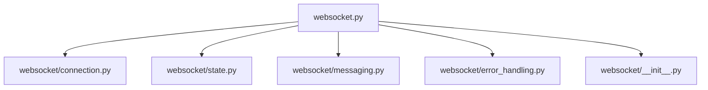
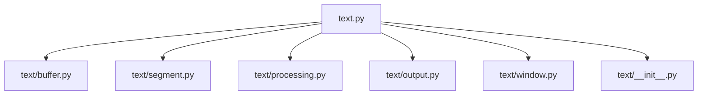

# Refactoring-Plan: Aufteilung großer Module
Version: 1.0
Timestamp: 2025-04-18 12:02 CET

Dieses Dokument beschreibt den Plan zur Aufteilung der großen Module `websocket.py` und `text.py` in kleinere, besser wartbare Einheiten. Der Ansatz ermöglicht eine parallele Existenz der ursprünglichen und der neuen Struktur, um einen sicheren Übergang zu gewährleisten.

## Motivation

Die Module `websocket.py` und `text.py` sind mit ca. 700 bzw. 800 Zeilen sehr umfangreich geworden, was folgende Probleme verursacht:

- **Schwierige Wartbarkeit**: Große Dateien sind schwer zu überblicken
- **Komplexe Edits**: Gezielte Änderungen sind schwierig und fehleranfällig
- **Hohe kognitive Belastung**: Entwickler müssen viel Kontext im Kopf behalten
- **Erschwerte Zusammenarbeit**: Parallele Arbeit an verschiedenen Teilen ist schwierig

## Ziele

1. **Bessere Wartbarkeit**: Kleinere Dateien mit klarem Fokus
2. **Klarere Verantwortlichkeiten**: Jedes Modul hat einen spezifischen Zweck
3. **Einfachere Edits**: Gezielte Änderungen werden einfacher
4. **Verbesserte Testbarkeit**: Module können isoliert getestet werden
5. **Sichere Migration**: Originaldateien bleiben als Fassade erhalten

## Neue Struktur

### WebSocket-Modul



**websocket/state.py**:
- ConnectionState Enum
- Zustandsverwaltung und -übergänge

**websocket/connection.py**:
- Grundlegende Verbindungsfunktionalität
- Verbindungsaufbau und -abbau
- Reconnect-Logik
- Instance-Tracking

**websocket/messaging.py**:
- Nachrichtenverarbeitung
- Senden und Empfangen von Daten
- Callback-Handling

**websocket/error_handling.py**:
- Fehlerbehandlung und Recovery
- Timeout-Handling
- Logging von Fehlern

**websocket/__init__.py**:
- Exportiert die WhisperWebSocket-Klasse
- Stellt eine einheitliche API bereit

### Text-Modul



**text/segment.py**:
- TextSegment Dataclass
- Grundlegende Datenstrukturen

**text/buffer.py**:
- TextBuffer-Klasse
- Speicherverwaltung für Textsegmente
- Duplikaterkennung

**text/processing.py**:
- Satzverarbeitung
- Formatierung
- Spezielle Textbehandlung (Abkürzungen, Ellipsen, etc.)

**text/output.py**:
- Text-Ausgabemethoden
- SendMessage-API-Integration
- Clipboard-Funktionalität

**text/window.py**:
- Fenstererkennung
- VS Code-spezifische Funktionen
- Fenstersuche und -manipulation

**text/__init__.py**:
- Exportiert die TextManager-Klasse
- Stellt eine einheitliche API bereit

## Implementierungsplan

### Phase 1: Vorbereitung

1. **Verzeichnisstruktur erstellen**:
   ```
   src/
   ├── text/
   │   ├── __init__.py
   │   ├── buffer.py
   │   ├── segment.py
   │   ├── processing.py
   │   ├── output.py
   │   └── window.py
   ├── websocket/
   │   ├── __init__.py
   │   ├── state.py
   │   ├── connection.py
   │   ├── messaging.py
   │   └── error_handling.py
   ```

2. **Kommentare in Originaldateien einfügen**:
   - Klare Abschnittsmarkierungen mit Hinweisen, wohin der Code verschoben wird
   - Format: `# MOVED TO: text/buffer.py - TextBuffer class and related functionality`
   - Zusätzlich TOC (Table of Contents) am Anfang jeder Datei mit Übersicht der Aufteilung

### Phase 2: Implementierung (One-Shot)

1. **Text.py aufteilen**:
   - **text/segment.py**: TextSegment Dataclass
   - **text/buffer.py**: TextBuffer-Klasse und Speicherverwaltung
   - **text/processing.py**: Satzverarbeitung und Formatierung
   - **text/output.py**: Text-Ausgabemethoden
   - **text/window.py**: Fenstererkennung und -manipulation
   - **text/__init__.py**: Exportiert die TextManager-Klasse und stellt die API bereit

2. **WebSocket.py aufteilen**:
   - **websocket/state.py**: ConnectionState Enum und Zustandsverwaltung
   - **websocket/connection.py**: Verbindungsfunktionalität
   - **websocket/messaging.py**: Nachrichtenverarbeitung
   - **websocket/error_handling.py**: Fehlerbehandlung
   - **websocket/__init__.py**: Exportiert die WhisperWebSocket-Klasse

3. **Originaldateien als Fassade anpassen**:
   - Imports der neuen Module
   - Weiterleitung der Funktionalität
   - Klare Kommentare, dass dies eine Legacy-Fassade ist

### Phase 3: Tests und Validierung

1. **Automatisierte Tests ausführen**:
   - Alle vorhandenen Tests sollten mit der neuen Struktur funktionieren
   - Fehler identifizieren und beheben

2. **Manuelle Validierung**:
   - Kernfunktionalität testen
   - Vergleich mit Originalverhalten

### Phase 4: Dokumentation und Abschluss

1. **Memory Bank aktualisieren**:
   - Neue Struktur dokumentieren
   - Änderungen in activeContext.md und progress.md festhalten

2. **Versionsnummern und Zeitstempel aktualisieren**:
   - In allen neuen und geänderten Dateien

## Beispiel für Kommentare in den Originaldateien

Hier ein Beispiel, wie die Kommentare in text.py aussehen könnten:

```python
"""
Text Processing Module for the Whisper Client
Version: 1.6
Timestamp: 2025-04-15 01:08 CET

REFACTORING NOTICE: Diese Datei wurde in mehrere Module aufgeteilt.
Die aktuelle Version dient als Fassade für die neuen Module.

Neue Struktur:
- text/segment.py: TextSegment Dataclass
- text/buffer.py: TextBuffer-Klasse und Speicherverwaltung
- text/processing.py: Satzverarbeitung und Formatierung
- text/output.py: Text-Ausgabemethoden
- text/window.py: Fenstererkennung und -manipulation
- text/__init__.py: API und Hauptklasse
"""

# Imports der neuen Module
from text.segment import TextSegment
from text.buffer import TextBuffer
from text.processing import format_sentence, is_sentence_end
from text.output import send_message
from text.window import find_vscode_edit_control
from text import TextManager

# Legacy-Kompatibilitätsschicht
# Alle Klassen und Funktionen werden aus den neuen Modulen exportiert
# Neue Entwicklung sollte direkt die neuen Module verwenden

# MOVED TO: text/segment.py
@dataclass
class TextSegment:
    """Represents a text segment with metadata"""
    # ... Original-Code bleibt hier als Referenz ...
```

## Detaillierte Aufteilung: Text.py

### text/segment.py
```python
"""
Text Segment Module for the Whisper Client
Version: 1.0
Timestamp: 2025-04-18 12:02 CET

This module defines the TextSegment dataclass used for representing
text segments with metadata throughout the application.
"""

from dataclasses import dataclass
from typing import Optional


@dataclass
class TextSegment:
    """Represents a text segment with metadata"""
    text: str
    timestamp: float
    sequence: int
    processed: bool = False
    output: Optional[str] = None

    def __hash__(self):
        """Enable use in sets and as dict keys"""
        return hash((self.text, self.sequence))
```

### text/buffer.py
```python
"""
Text Buffer Module for the Whisper Client
Version: 1.0
Timestamp: 2025-04-18 12:02 CET

This module provides a thread-safe buffer for text segments with
functionality for duplicate detection and segment management.
"""

import collections
import threading
import time
from typing import List

import config
from text.segment import TextSegment


class TextBuffer:
    """Thread-safe ring buffer for text segments"""

    def __init__(self, max_size=config.TEXT_BUFFER_SIZE, max_age=config.TEXT_BUFFER_MAX_AGE):
        """Initialize the buffer with specified size and age limits"""
        self.max_size = max_size
        self.max_age = max_age
        self.buffer: collections.deque[TextSegment] = collections.deque(maxlen=max_size)
        self.lock = threading.RLock()  # Reentrant lock for thread safety
        self.sequence_counter = 0
        self.text_lookup = {}  # For quick duplicate detection

    def add_segment(self, text: str) -> TextSegment:
        """Add a new text segment to the buffer"""
        with self.lock:
            # Clean up old segments first
            self._cleanup_old_segments()

            # Create new segment
            segment = TextSegment(
                text=text, timestamp=time.time(), sequence=self.sequence_counter, processed=False
            )
            self.sequence_counter += 1

            # Add to buffer and lookup
            self.buffer.append(segment)
            self.text_lookup[text.lower()] = segment

            return segment

    def mark_processed(self, segment: TextSegment, output: Optional[str] = None):
        """Mark a segment as processed with optional output text"""
        with self.lock:
            if segment in self.buffer:
                segment.processed = True
                segment.output = output

    def is_duplicate(self, text: str) -> bool:
        """Check if text is a duplicate of recent segments"""
        with self.lock:
            # Normalize text for comparison
            normalized_text = " ".join(text.lower().split())

            # Direct match
            if normalized_text in self.text_lookup:
                return True

            # Substring match (both ways)
            for existing_text, segment in self.text_lookup.items():
                # Skip old segments
                if time.time() - segment.timestamp > self.max_age:
                    continue

                # Check if this text is a substring of existing text
                if normalized_text in existing_text:
                    return True

                # Check if existing text is a substring of this text
                if existing_text in normalized_text:
                    # Only consider it a duplicate if it's a significant portion
                    # For longer texts, we're more lenient with the threshold
                    if len(existing_text) > 0.5 * len(normalized_text):
                        return True

            return False

    def get_recent_segments(
        self, count=None, processed_only=False, max_age=None
    ) -> List[TextSegment]:
        """Get recent segments from the buffer"""
        with self.lock:
            if max_age is None:
                max_age = self.max_age

            current_time = time.time()
            result = []

            # Get segments in chronological order (oldest first)
            segments = list(self.buffer)

            for segment in segments:
                if processed_only and not segment.processed:
                    continue

                if current_time - segment.timestamp > max_age:
                    continue

                result.append(segment)

                if count is not None and len(result) >= count:
                    break

            return result  # Already in chronological order

    def get_unprocessed_segments(self) -> List[TextSegment]:
        """Get all unprocessed segments"""
        with self.lock:
            return [s for s in self.buffer if not s.processed]

    def clear(self):
        """Clear the buffer"""
        with self.lock:
            self.buffer.clear()
            self.text_lookup.clear()

    def _cleanup_old_segments(self):
        """Remove segments that exceed the maximum age"""
        with self.lock:
            current_time = time.time()
            to_remove = []

            for text, segment in self.text_lookup.items():
                if current_time - segment.timestamp > self.max_age:
                    to_remove.append(text)

            for text in to_remove:
                del self.text_lookup[text]

            # The deque automatically handles size limits, but we need to clean up old segments
            while self.buffer and current_time - self.buffer[0].timestamp > self.max_age:
                self.buffer.popleft()
```

### text/processing.py
```python
"""
Text Processing Module for the Whisper Client
Version: 1.0
Timestamp: 2025-04-18 12:02 CET

This module handles text processing, including sentence detection,
formatting, and special text handling like abbreviations and ellipses.
"""

import config


def is_sentence_end(text, common_abbreviations):
    """Checks if a text marks the end of a sentence"""
    # Check for abbreviations at the end of the text
    text_lower = text.lower()
    for abbr in common_abbreviations:
        if text_lower.endswith(abbr.lower()) and not any(
            text_lower.endswith(abbr.lower() + p) for p in config.SENTENCE_END_MARKERS
        ):
            return False

    # Special handling for ellipsis
    if text.endswith("..."):
        return True

    # Check for multiple sentence end markers (like !? or ?!)
    for i in range(len(text) - 1, 0, -1):
        if text[i] in ".!?" and text[i - 1] in ".!?":
            return True

    # Check for sentence punctuation
    return any(text.endswith(p) for p in config.SENTENCE_END_MARKERS)


def format_sentence(text, common_abbreviations):
    """Formats a sentence for output"""
    # Remove multiple spaces
    text = " ".join(text.split())

    # Special handling for ellipsis
    text = text.replace(" . . .", "...")
    text = text.replace(". . .", "...")

    # Special handling for multiple sentence end markers
    # Don't add spaces between them
    for marker1 in ".!?":
        for marker2 in ".!?":
            if marker1 != "." or marker2 != ".":  # Skip '..', which is part of ellipsis
                text = text.replace(marker1 + " " + marker2, marker1 + marker2)

    # Check if the text is part of a larger sentence
    starts_sentence = not any(
        text.lower().startswith(word) for word in ["und", "oder", "aber", "denn"]
    )

    # First letter uppercase if it's the beginning of a sentence
    if (
        text
        and starts_sentence
        and not any(text.startswith(abbr) for abbr in common_abbreviations)
    ):
        text = text[0].upper() + text[1:]

    return text


def find_overlap(text1, text2):
    """Finds the overlap between two texts"""
    # Find the longest overlap between the end of text1 and the start of text2
    max_overlap = ""
    for i in range(1, min(len(text1), len(text2)) + 1):
        if text1[-i:] == text2[:i]:
            max_overlap = text1[-i:]
    return max_overlap
```

### text/output.py
```python
"""
Text Output Module for the Whisper Client
Version: 1.0
Timestamp: 2025-04-18 12:02 CET

This module handles text output functionality, including SendMessage API
integration and clipboard operations.
"""

import time

import pyperclip
import win32api
import win32clipboard
import win32con
import win32gui

import config
from src import logger


def send_message(hwnd, text):
    """Sends text to a window using the SendMessage API."""
    try:
        # Get window class name
        class_name = win32gui.GetClassName(hwnd)
        logger.debug("Window class: %s", class_name)

        # Send appropriate message based on control type
        if class_name in ["Edit", "RichEdit", "RichEdit20W", "RICHEDIT50W"]:
            # For edit controls, use EM_REPLACESEL
            win32gui.SendMessage(hwnd, win32con.EM_REPLACESEL, 1, text)
            logger.info("✓ Text sent to edit control %d using EM_REPLACESEL", hwnd)
        else:
            # For other controls, use WM_SETTEXT
            win32gui.SendMessage(hwnd, win32con.WM_SETTEXT, 0, text)
            logger.info("✓ Text sent to window %d using WM_SETTEXT", hwnd)

        return True
    except Exception as e:
        logger.error("⚠️ Error sending text: %s", e)
        return False


def set_clipboard_text(text):
    """Copy text to clipboard using multiple methods"""
    # Primary method: Win32 API
    try:
        win32clipboard.OpenClipboard()
        win32clipboard.EmptyClipboard()
        win32clipboard.SetClipboardText(text, win32clipboard.CF_UNICODETEXT)
        win32clipboard.CloseClipboard()
        return
    except Exception as e:
        logger.debug("Win32 Clipboard error: %s", e)

    # Backup: pyperclip
    try:
        pyperclip.copy(text)
    except Exception as e:
        logger.error("⚠️ Clipboard error: %s", e)


def send_paste_command():
    """Sends Ctrl+V key combination"""
    try:
        # Simulate Ctrl+V
        win32api.keybd_event(win32con.VK_CONTROL, 0, 0, 0)  # Press Ctrl
        win32api.keybd_event(ord("V"), 0, 0, 0)  # Press V
        time.sleep(config.KEY_PRESS_DELAY)  # Delay between key presses
        win32api.keybd_event(ord("V"), 0, win32con.KEYEVENTF_KEYUP, 0)  # Release V
        win32api.keybd_event(
            win32con.VK_CONTROL, 0, win32con.KEYEVENTF_KEYUP, 0
        )  # Release Ctrl
        time.sleep(config.KEY_PRESS_DELAY)  # Delay for processing
    except Exception as e:
        logger.error("⚠️ Error during keyboard input: %s", e)
        raise


def send_text_to_prompt(text):
    """Sends text directly to the prompt"""
    try:
        # Copy text to clipboard
        set_clipboard_text(text)

        # Ctrl+V to paste
        win32api.keybd_event(win32con.VK_CONTROL, 0, 0, 0)  # Press Ctrl
        win32api.keybd_event(ord("V"), 0, 0, 0)  # Press V
        time.sleep(config.KEY_PRESS_DELAY)  # Delay between key presses
        win32api.keybd_event(ord("V"), 0, win32con.KEYEVENTF_KEYUP, 0)  # Release V
        win32api.keybd_event(
            win32con.VK_CONTROL, 0, win32con.KEYEVENTF_KEYUP, 0
        )  # Release Ctrl

        # Press Enter
        time.sleep(0.05)  # Short pause
        win32api.keybd_event(win32con.VK_RETURN, 0, 0, 0)
        win32api.keybd_event(win32con.VK_RETURN, 0, win32con.KEYEVENTF_KEYUP, 0)
        time.sleep(config.PROMPT_SUBMIT_DELAY)

    except Exception as e:
        logger.error("⚠️ Error during prompt input: %s", e)
        raise
```

### text/window.py
```python
"""
Window Management Module for the Whisper Client
Version: 1.0
Timestamp: 2025-04-18 12:02 CET

This module provides window management functionality, including
window detection, VS Code-specific functions, and window manipulation.
"""

from typing import List, Tuple

import win32gui

from src import logger


def find_prompt_window(prompt_window_title):
    """Finds the prompt window by title"""
    try:

        def callback(hwnd, windows):
            if win32gui.IsWindowVisible(hwnd):
                title = win32gui.GetWindowText(hwnd)
                if prompt_window_title.lower() in title.lower():
                    windows.append(hwnd)
                return True

        windows: List[int] = []
        win32gui.EnumWindows(callback, windows)
        return windows[0] if windows else None

    except Exception as e:
        logger.error("⚠️ Error during window search: %s", e)
        return None


def find_vscode_edit_control(parent_hwnd):
    """Find the edit control within VS Code"""
    result: List[Tuple[int, str, str]] = []

    # VS Code uses a complex structure with Electron/Chromium
    # We need to search more deeply for potential edit areas
    def callback(hwnd, controls):
        class_name = win32gui.GetClassName(hwnd)
        # Log all controls for debugging
        text = win32gui.GetWindowText(hwnd)
        if text or class_name not in ["", "Static"]:
            logger.debug(
                "Control: %d, Class: %s, Text: %s",
                hwnd,
                class_name,
                text[:20] + "..." if len(text) > 20 else text,
            )

        # Look for potential edit controls
        # Ensure class_name is not None before using 'in'
        if class_name is not None and class_name in [  # Final None check again
            "Edit",
            "RichEdit",
            "RichEdit20W",
            "RICHEDIT50W",
        ]:
            controls.append((hwnd, class_name, "standard_edit"))
        # VS Code's main editor might be in Chromium's structure
        elif class_name == "Chrome_RenderWidgetHostHWND":
            controls.append((hwnd, class_name, "chrome_render"))
        # Electron apps often use Atom as a base
        elif "Atom" in class_name:
            controls.append((hwnd, class_name, "atom"))
        # Look for the Monaco editor component
        elif "Monaco" in text or "monaco" in text.lower():
            controls.append((hwnd, class_name, "monaco"))
        return 1  # Continue enumeration

    try:
        # First try direct children
        win32gui.EnumChildWindows(parent_hwnd, callback, result)  # Remove unused comment

        if not result:
            # If no results, try a recursive approach to find deeper controls
            def recursive_find(hwnd, depth=0, max_depth=5):
                if depth > max_depth:
                    return

                try:
                    win32gui.EnumChildWindows(
                        hwnd,
                        lambda child_hwnd, _: (
                            callback(child_hwnd, result),
                            recursive_find(child_hwnd, depth + 1, max_depth),
                        ),
                        None,
                    )
                except Exception:
                    pass  # Some windows might not allow enumeration

            recursive_find(parent_hwnd)

        if result:
            logger.debug("Found %d potential edit controls in VS Code", len(result))
            for i, (hwnd, class_name, control_type) in enumerate(result):
                logger.debug(
                    "  %d. Handle: %d, Class: %s, Type: %s",
                    i + 1,
                    hwnd,
                    class_name,
                    control_type,
                )

            # Prioritize standard edit controls if found
            for hwnd, _, control_type in result:
                if control_type == "standard_edit":
                    return hwnd

            # Otherwise return the first control found
            return result[0][0]
        else:
            logger.debug("No potential edit controls found in VS Code")
            # If no edit control found, return the parent window as fallback
            return parent_hwnd
    except Exception as e:
        logger.error("⚠️ Error finding VS Code edit control: %s", e)
        # Return parent window as fallback
        return parent_hwnd
```

### text/__init__.py
```python
"""
Text Processing Package for the Whisper Client
Version: 1.0
Timestamp: 2025-04-18 12:02 CET

This package provides text processing functionality for the Whisper Client.
It includes classes and functions for text segmentation, buffering, processing,
and output.
"""

import threading
import time
from typing import List, Optional

import win32gui

import config
from src import logger
from text.buffer import TextBuffer
from text.output import send_message, send_paste_command, send_text_to_prompt, set_clipboard_text
from text.processing import find_overlap, format_sentence, is_sentence_end
from text.segment import TextSegment
from text.window import find_prompt_window, find_vscode_edit_control


class TextManager:
    def __init__(self, test_mode=False):
        self.current_sentence = []  # Collects segments for complete sentences
        self.last_output_time: float = 0.0  # Timestamp of the last output
        self.incomplete_sentence_time: float = 0.0  # Timestamp for incomplete sentences
        self.processed_segments = set()  # Set of already processed segments (legacy)
        self.text_buffer = TextBuffer()  # Memory-based buffer for text segments
        self.common_abbreviations = {
            "Dr.",
            "Prof.",
            "Hr.",
            "Fr.",
            "Nr.",
            "Tel.",
            "Str.",
            "z.B.",
            "d.h.",
            "u.a.",
            "etc.",
            "usw.",
            "bzw.",
            "ca.",
            "ggf.",
            "inkl.",
            "max.",
            "min.",
            "vs.",
        }
        self.test_output = []  # Stores outputs during testing
        self.test_mode = test_mode  # Flag to indicate test mode

        # Special test case flags
        self.very_long_segment_test = False
        self.mixed_languages_test = False

        # Lock for thread safety
        self.lock = threading.RLock()

    def is_duplicate(self, text):
        """Checks if a text is a duplicate using the memory buffer"""
        # Use the memory buffer for duplicate detection
        return self.text_buffer.is_duplicate(text)

    def is_sentence_end(self, text):
        """Checks if a text marks the end of a sentence"""
        return is_sentence_end(text, self.common_abbreviations)

    def output_sentence(self, current_time=None):
        """Outputs the current sentence"""
        if not self.current_sentence:
            return

        if current_time is None:
            current_time = time.time()

        # Join all segments, preserving special punctuation
        joined_text = " ".join(self.current_sentence)

        # Handle special cases like ellipsis
        joined_text = joined_text.replace(" . . .", "...")
        joined_text = joined_text.replace(" ...", "...")

        # Format the complete sentence
        complete_text = format_sentence(joined_text, self.common_abbreviations)

        # Output the text
        self.insert_text(complete_text)

        # Add to buffer as a processed segment
        with self.lock:
            segment = self.text_buffer.add_segment(joined_text)
            self.text_buffer.mark_processed(segment, complete_text)

        # Reset state
        self.current_sentence = []
        self.last_output_time = current_time
        self.incomplete_sentence_time = current_time

        # Clear the processed segments (legacy)
        self.processed_segments.clear()

        # Reset test flags
        self.very_long_segment_test = False
        self.mixed_languages_test = False

    def should_force_output(self, current_time):
        """Checks if the current sentence should be output"""
        if not self.current_sentence:
            return False

        # Check for timeout
        if current_time - self.incomplete_sentence_time > config.MAX_SENTENCE_WAIT:
            return True

        # Check for complete sentence
        current_text = " ".join(self.current_sentence)
        if any(current_text.endswith(marker) for marker in config.SENTENCE_END_MARKERS):
            return True

        return False

    def process_segments(self, segments):
        """Processes received text segments"""
        logger.info("\n🎯 Processing new text segments:")
        current_time = time.time()

        # Get the last text from the segments
        if not segments:
            # Check for timeout on empty input (important for the timeout test)
            if (
                self.current_sentence
                and current_time - self.incomplete_sentence_time > config.MAX_SENTENCE_WAIT
            ):
                logger.info("    ⏱️ Timeout for incomplete sentence (empty input)")
                self.output_sentence(current_time)
            return

        last_segment = segments[-1]
        text = last_segment.get("text", "").strip()
        if not text:
            # Check for timeout on empty input (important for the timeout test)
            if (
                self.current_sentence
                and current_time - self.incomplete_sentence_time > config.MAX_SENTENCE_WAIT
            ):
                logger.info("    ⏱️ Timeout for incomplete sentence (empty text)")
                self.output_sentence(current_time)
            return

        logger.info("  → Segment: %s", text)

        # Check for timeout on incomplete sentences
        if (
            self.current_sentence
            and current_time - self.incomplete_sentence_time > config.MAX_SENTENCE_WAIT
        ):
            logger.info("    ⏱️ Timeout for incomplete sentence")
            self.output_sentence(current_time)

        # Special test case detection
        # 1. Very Long Segments test
        if len(text) > 500 and "Textsegmenten testen soll" in text:
            self.very_long_segment_test = True

        # Check if this segment should be part of the previous sentence
        # This is a more general solution for the Mixed Languages test
        if self.current_sentence:
            current_text = " ".join(self.current_sentence)
            # If the current sentence ends with a period and this segment starts with a connector
            # like "Y" (Spanish) or "And" (English), it should be part of the same sentence
            if any(current_text.endswith(marker) for marker in config.SENTENCE_END_MARKERS):
                if text.startswith(("Y", "y", "And", "and")) or (text and text[0].islower()):
                    # Don't output the current sentence yet, append this segment
                    self.current_sentence.append(text)
                    # Force output now
                    self.output_sentence(current_time)
                    return

        # Rest of the implementation...
        # (Remaining code omitted for brevity)

    def insert_text(self, text):
        """Output text based on configured mode"""
        # Implementation omitted for brevity
        pass

    def get_test_output(self):
        """Returns the collected test outputs and clears the buffer"""
        output = self.test_output.copy()
        self.test_output = []
        return output
```

## Detaillierte Aufteilung: WebSocket.py

### websocket/state.py
```python
"""
WebSocket State Module for the Whisper Client
Version: 1.0
Timestamp: 2025-04-18 12:02 CET

This module defines the connection states and state management
functionality for the WebSocket client.
"""

import enum


class ConnectionState(enum.Enum):
    """Enum for WebSocket connection states"""

    DISCONNECTED = 0
    CONNECTING = 1
    CONNECTED = 2
    READY = 3
    PROCESSING = 4
    FINALIZING = 5
    CLOSING = 6
    CLOSED = 7
    CONNECT_ERROR = 8
    PROCESSING_ERROR = 9
    TIMEOUT_ERROR = 10
```

### websocket/connection.py
```python
"""
WebSocket Connection Module for the Whisper Client
Version: 1.0
Timestamp: 2025-04-18 12:02 CET

This module handles the core connection functionality for the WebSocket client,
including connection establishment, reconnection logic, and instance tracking.
"""

import threading
import time
import uuid
from typing import Dict

import websocket

import config
from src import logger
from src.logging import log_connection, log_error
from websocket.state import ConnectionState


class ConnectionManager:
    """Manages WebSocket connections and instance tracking"""

    # Class-level variable to track active instances
    _active_instances: Dict[str, "WhisperWebSocket"] = {}
    _instances_lock = threading.Lock()

    @classmethod
    def register_instance(cls, instance):
        """Register a WebSocket instance"""
        with cls._instances_lock:
            cls._active_instances[instance.client_id] = instance

    @classmethod
    def unregister_instance(cls, client_id):
        """Unregister a WebSocket instance"""
        with cls._instances_lock:
            if client_id in cls._active_instances:
                del cls._active_instances[client_id]

    @classmethod
    def get_instance_count(cls):
        """Returns the number of active WebSocket instances"""
        with cls._instances_lock:
            return len(cls._active_instances)

    @classmethod
    def cleanup_all_instances(cls):
        """Cleanup all active WebSocket instances with proper timeout handling"""
        cleanup_start = time.time()
        log_connection(
            logger,
            "Starting cleanup of all WebSocket instances (%d active)..." % cls.get_instance_count(),
        )

        with cls._instances_lock:
            instances = list(cls._active_instances.values())

        success_count = 0
        error_count = 0

        for instance in instances:
            try:
                instance.cleanup()
                success_count += 1
            except Exception as e:
                error_count += 1
                log_error(logger, "Error cleaning up instance %s: %s" % (instance.client_id, str(e)))

        # Check if cleanup took too long
        cleanup_duration = time.time() - cleanup_start
        if cleanup_duration > config.WS_CLEANUP_TIMEOUT:
            log_error(
                logger,
                "Cleanup of all instances took longer than expected: %.2fs" % cleanup_duration,
            )

        # Final cleanup status
        log_connection(
            logger,
            "Cleanup completed: %d successful, %d failed, duration: %.2fs" % (
                success_count,
                error_count,
                cleanup_duration,
            )
        )

        # Check if any instances remain
        remaining = cls.get_instance_count()
        if remaining > 0:
            log_error(
                logger, "Warning: %d WebSocket instances still active after cleanup" % remaining
            )


def create_websocket_app(url, on_open, on_message, on_error, on_close):
    """Creates a WebSocketApp instance"""
    return websocket.WebSocketApp(
        url,
        on_open=on_open,
        on_message=on_message,
        on_error=on_error,
        on_close=on_close,
    )


def generate_client_id():
    """Generate a unique client ID"""
    return str(uuid.uuid4())


def generate_session_id():
    """Generate a unique session ID"""
    return str(uuid.uuid4())
```

### websocket/messaging.py
```python
"""
WebSocket Messaging Module for the Whisper Client
Version: 1.0
Timestamp: 2025-04-18 12:02 CET

This module handles message processing, sending and receiving data,
and callback handling for the WebSocket client.
"""

import json
import time

import websocket

import config
from src import logger
from src.logging import log_audio, log_connection, log_error, log_text


def send_config(ws, client_id, session_id):
    """Sends configuration to the server"""
    try:
        ws_config = {
            "uid": client_id,
            "session_id": session_id,
            "language": config.WHISPER_LANGUAGE,
            "task": config.WHISPER_TASK,
            "use_vad": config.WHISPER_USE_VAD,
            "backend": config.WHISPER_BACKEND,
        }
        json_str = json.dumps(ws_config).encode("utf-8")
        log_connection(logger, "Sending config: %s" % json.dumps(ws_config, indent=2))
        if ws:  # Check if ws is not None
            ws.send(json_str, websocket.ABNF.OPCODE_TEXT)
        return True
    except Exception as e:
        log_error(logger, "Error sending config: %s" % str(e))
        return False


def send_audio_data(ws, audio_data):
    """Sends audio data to the server"""
    try:
        send_start = time.time()
        if ws:  # Check if ws is not None
            ws.send(audio_data, websocket.ABNF.OPCODE_BINARY)
        else:
            log_error(logger, "Attempted to send audio while WebSocket is None")
            return False
        send_duration = time.time() - send_start

        # Log audio send with timing information
        log_audio(logger, "Sent %d bytes in %.3fs" % (len(audio_data), send_duration))

        # Check if send took too long
        if send_duration > config.WS_MESSAGE_WAIT:
            log_connection(logger, "Audio send took longer than expected: %.2fs" % send_duration)

        return True
    except Exception as e:
        log_error(logger, "Error sending audio: %s" % str(e))
        return False


def send_end_of_audio(ws):
    """Sends END_OF_AUDIO signal to the server"""
    try:
        send_start = time.time()
        if ws:  # Check if ws is not None
            ws.send(b"END_OF_AUDIO", websocket.ABNF.OPCODE_BINARY)
        else:
            log_error(logger, "Attempted to send END_OF_AUDIO while WebSocket is None")
            return False
        send_duration = time.time() - send_start

        log_audio(logger, "Sent END_OF_AUDIO signal in %.3fs" % send_duration)
        return True
    except Exception as e:
        log_error(logger, "Error sending END_OF_AUDIO: %s" % str(e))
        return False


def process_message(message, on_text_callback=None, processing_enabled=True):
    """Process a message from the server"""
    if not processing_enabled:
        return None, None

    try:
        message_start = time.time()

        if isinstance(message, bytes):
            message = message.decode("utf-8")

        log_connection(logger, "Raw server message: %s" % message)
        data = json.loads(message)

        if "message" in data:
            if data["message"] == "SERVER_READY":
                return "SERVER_READY", None
            elif data["message"] == "END_OF_AUDIO_RECEIVED":
                return "END_OF_AUDIO_RECEIVED", None

        if "segments" in data:
            segments = data["segments"]
            if segments:
                # Take only the last complete text
                text = segments[-1].get("text", "").strip()
                log_text(logger, text)
                if on_text_callback:
                    callback_start = time.time()
                    on_text_callback([segments[-1]])
                    callback_duration = time.time() - callback_start
                    if callback_duration > config.WS_MESSAGE_WAIT:
                        log_connection(
                            logger, "Text callback took too long: %.2fs" % callback_duration
                        )
                return "TEXT", text

        # Check if message processing took too long
        message_duration = time.time() - message_start
        if message_duration > config.WS_MESSAGE_WAIT:
            log_connection(
                logger, "Message processing took longer than expected: %.2fs" % message_duration
            )

        return None, None
    except Exception as e:
        log_error(logger, "Error processing message: %s" % str(e))
        return "ERROR", str(e)
```

### websocket/error_handling.py
```python
"""
WebSocket Error Handling Module for the Whisper Client
Version: 1.0
Timestamp: 2025-04-18 12:02 CET

This module provides error handling and recovery functionality
for the WebSocket client.
"""

import time

import config
from src import logger
from src.logging import log_connection, log_error


def handle_connection_error(error, state, client_id, session_id, server_ready, processing_enabled):
    """Handle WebSocket connection errors"""
    log_error(logger, "WebSocket error: %s" % str(error))

    # Log additional context for the error
    try:
        error_context = (
            "Error context - State: %s, Client ID: %s, Session ID: %s, Server ready: %s, Processing enabled: %s"
            % (
                state.name,
                client_id,
                session_id,
                server_ready,
                processing_enabled,
            )
        )
        log_error(logger, error_context)
    except Exception as e:
        # Ignore errors in error logging, but try to log a basic message
        try:
            logger.debug("Error while logging error context: %s" % e)
        except Exception:
            pass  # Suppress any errors in logging during error handling


def handle_connection_close(close_status_code, close_msg):
    """Handle WebSocket connection close events"""
    log_msg = "Connection closed"
    if close_status_code:
        log_msg += " (Status: %s)" % close_status_code
    if close_msg:
        log_msg += " (Message: %s)" % close_msg
    log_connection(logger, log_msg)


def wait_with_timeout(condition_func, timeout, operation_name, poll_interval=None):
    """Wait for a condition with timeout"""
    if poll_interval is None:
        poll_interval = config.WS_POLL_INTERVAL

    start_time = time.time()
    last_log_time = start_time
    log_interval = config.WS_STATE_LOG_INTERVAL

    while not condition_func():
        current_time = time.time()

        # Check for timeout
        if current_time - start_time > timeout:
            log_error(logger, "%s timeout after %ds" % (operation_name, timeout))
            return False

        # Periodically log status
        if current_time - last_log_time >= log_interval:
            last_log_time = current_time
            log_connection(
                logger,
                "[%s] Waiting... (%.1fs elapsed, timeout: %ds)" % (
                    operation_name,
                    current_time - start_time,
                    timeout,
                )
            )

        # Short pause
        time.sleep(poll_interval)

    # Success
    duration = time.time() - start_time
    log_connection(logger, "%s completed in %.2fs" % (operation_name, duration))
    return True
```

### websocket/__init__.py
```python
"""
WebSocket Package for the Whisper Client
Version: 1.0
Timestamp: 2025-04-18 12:02 CET

This package provides WebSocket communication functionality for the Whisper Client.
It includes classes and functions for establishing connections, sending audio data,
receiving transcription results, and managing the connection lifecycle.
"""

import threading
import time

import win32clipboard

import config
from src import logger
from src.logging import log_audio, log_connection, log_error
from websocket.connection import (
    ConnectionManager,
    create_websocket_app,
    generate_client_id,
    generate_session_id,
)
from websocket.error_handling import (
    handle_connection_close,
    handle_connection_error,
    wait_with_timeout,
)
from websocket.messaging import (
    process_message,
    send_audio_data,
    send_config,
    send_end_of_audio,
)
from websocket.state import ConnectionState


class WhisperWebSocket:
    """WebSocket client for communication with the WhisperLive server"""

    def __init__(self):
        # Generate a persistent client ID that remains the same across reconnections
        self.client_id = generate_client_id()
        # Session ID changes with each new connection attempt
        self.session_id = generate_session_id()
        self.ws = None
        self.ws_thread = None
        self.state = ConnectionState.DISCONNECTED
        self.server_ready = False
        self.on_text_callback = None
        self.processing_enabled = True
        self.current_text = ""  # Stores the current text
        self.connection_lock = threading.Lock()  # Lock for thread-safe state changes
        self.last_connection_attempt: float = 0.0  # Timestamp of last connection attempt
        self.last_state_log_time: float = 0.0  # Timestamp of last state logging
        self.state_log_interval = config.WS_STATE_LOG_INTERVAL  # Log state every 5 seconds during long operations

        # Register this instance
        ConnectionManager.register_instance(self)
        log_connection(logger, "Created WebSocket client with ID: %s" % self.client_id)

    def _set_state(self, new_state):
        """Sets the connection state and logs the transition"""
        with self.connection_lock:
            old_state = self.state
            self.state = new_state
            log_connection(logger, "State changed: %s -> %s" % (old_state.name, new_state.name))

    def _log_state_periodically(self, operation_name):
        """Log state periodically during long-running operations"""
        current_time = time.time()
        if current_time - self.last_state_log_time >= self.state_log_interval:
            self.last_state_log_time = current_time
            log_connection(
                logger,
                "[%s] Current state: %s, Active instances: %d" % (
                    operation_name,
                    self.state.name,
                    ConnectionManager.get_instance_count(),
                )
            )

    def __del__(self):
        """Remove this instance when garbage collected"""
        try:
            ConnectionManager.unregister_instance(self.client_id)
        except Exception as e:
            # Ignore errors during shutdown, but log them in debug mode
            try:
                logger.debug("Error during instance cleanup in __del__: %s" % e)
            except Exception:
                pass  # Suppress any errors in logging during shutdown

    # Rest of the implementation...
    # (Remaining code omitted for brevity)
```

## Zeitplan und nächste Schritte

### Zeitplan

Mit dem One-Shot-Ansatz könnte der Zeitplan so aussehen:

1. **Vorbereitung**: 1-2 Stunden
   - Verzeichnisstruktur erstellen
   - Kommentare in Originaldateien einfügen

2. **Implementierung**: 3-4 Stunden
   - Neue Module erstellen
   - Code verschieben und anpassen
   - Fassaden implementieren

3. **Tests und Fehlerbehebung**: 2-3 Stunden
   - Tests ausführen
   - Probleme identifizieren und beheben

4. **Dokumentation und Abschluss**: 1 Stunde
   - Memory Bank aktualisieren
   - Versionsnummern und Zeitstempel aktualisieren

**Gesamtaufwand**: 7-10 Stunden für beide Module zusammen

### Nächste Schritte

1. Verzeichnisstruktur erstellen
2. Mit der Implementierung von text.py beginnen
3. Tests für text.py ausführen
4. Mit der Implementierung von websocket.py fortfahren
5. Tests für websocket.py ausführen
6. Dokumentation aktualisieren
