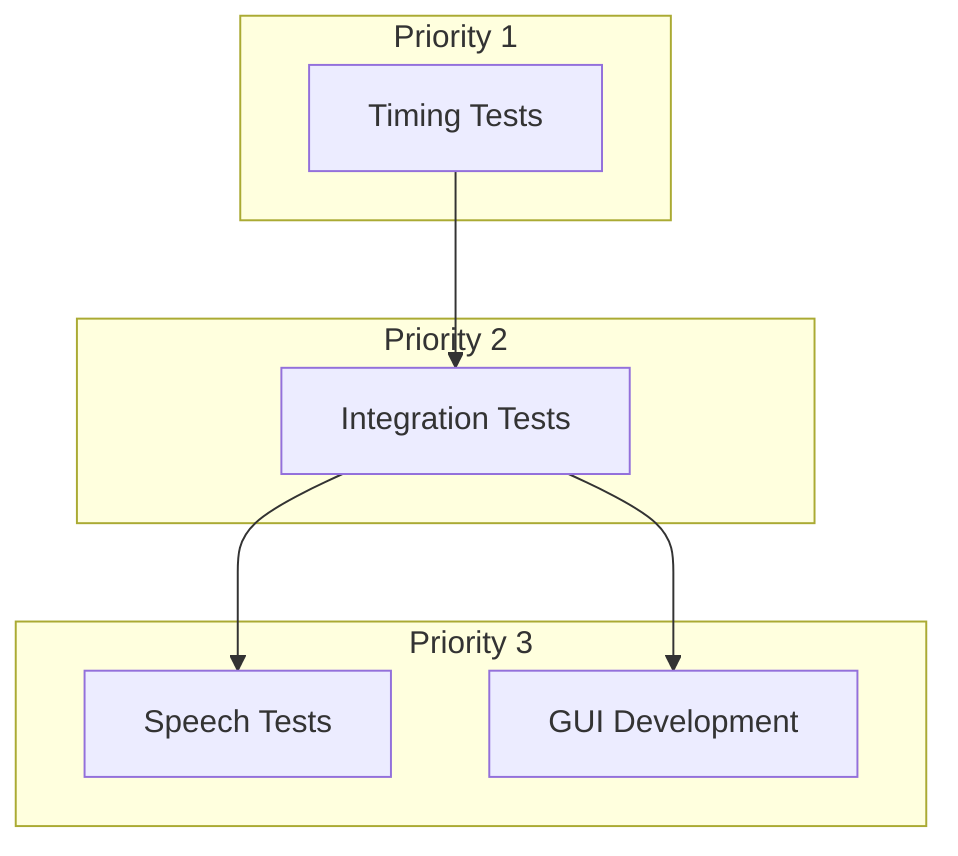

# WhisperClient Test Architecture
Version: 1.0
Timestamp: 2025-02-26 21:10 CET

## Overview
This document outlines the test architecture for WhisperClient, with a focus on German speech recognition. The test strategy follows a phased approach, ensuring core functionality is stable before moving to more complex features.

## 1. Core Timing Tests
Primary focus, must be stable first.

### 1.1 Pre-recorded Tests
```python
tests/
└── timing/
    ├── resources/
    │   ├── test_2sec.wav     # Base test file
    │   └── test_markers.json # Timing data
    ├── test_audio_flow.py    # Audio → Server
    ├── test_server_flow.py   # Server processing
    └── test_timing_chain.py  # Complete chain
```

### 1.2 Success Criteria
- Audio transmission complete
- Server processing verified
- Text reception confirmed
- Stable timing baseline

## 2. Basic Integration Tests
Built on stable timing foundation.

### 2.1 Components
```python
tests/
└── integration/
    ├── test_websocket.py     # Connection handling
    ├── test_text_proc.py     # Text processing
    └── test_output.py        # Basic output
```

### 2.2 Success Criteria
- Reliable connections
- Basic text processing
- Simple output verified

## 3. Speech Recognition Tests
Only after stable base system. All speech tests focus on German language recognition.

### 3.1 Test Categories
```python
tests/
└── speech/
    ├── test_basic.py         # Simple German sentences
    ├── test_complex.py       # Advanced German cases
    └── test_edge_cases.py    # Special scenarios
```

### 3.2 Success Criteria
- German speech recognition accuracy
- Language-specific handling
- Edge case management

## Test Dependencies


## Implementation Order
1. **Phase 1: Timing (Current Focus)**
   - Pre-recorded audio tests
   - Timing chain validation
   - Stability metrics

2. **Phase 2: Integration**
   - Basic WebSocket tests
   - Simple text processing
   - Output verification

3. **Phase 3: Features**
   - German speech recognition
   - GUI elements
   - Advanced features

## Test Resources
- All speech test cases are maintained in German
- Test audio files contain German speech samples
- Documentation is in English for broader accessibility
- Test output validation focuses on German text

## Next Steps
1. Implement timing test framework
2. Create test audio resources
3. Establish baseline measurements
4. Document timing requirements

## Note on Language
While this documentation is maintained in English for broader accessibility, the primary focus of the speech recognition system is German. All speech test cases, audio samples, and recognition accuracy metrics are specifically designed for and validated against German language input.
